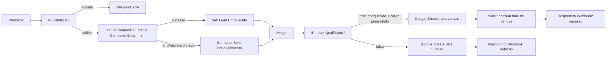

# LeadFlow AI — Captura e Enriquecimento Automático de Leads B2B

> Workflow n8n que recebe leads via webhook, enriquece os dados automaticamente com a API do Hunter.io, qualifica o lead com base no cargo identificado, e direciona para o time de vendas (Slack + Google Sheets) ou para uma lista de nutrição — sem nenhuma intervenção manual.

  

---

##  O problema de negócio

Times de vendas recebem leads de formulários (site, landing page, evento) e perdem tempo enriquecendo manualmente cada lead (cargo, empresa, e-mail corporativo) antes de decidir se vale a pena entrar em contato. Esse workflow automatiza inteiramente essa triagem inicial.

##  Arquitetura

##  Como o fluxo funciona, passo a passo

1. **Webhook** recebe o POST com `nome` e `email` do lead (simulando o formulário do site).
2. **IF de validação** confirma que os dois campos vieram preenchidos.
3. **HTTP Request** chama o endpoint **Combined Enrichment** do Hunter.io (`GET /v2/combined/find`), autenticado via credencial **Query Auth** (a chave nunca fica exposta no workflow).
4. O nó está configurado com **"On Error: Continue (using error output)"** — então, mesmo quando o Hunter não encontra o e-mail (ou recusa por ser webmail/role-based), o fluxo **não quebra**: ele segue por um caminho alternativo.
5. Dois nós **Set** normalizam os dados, dependendo do caminho (enriquecido com sucesso ou não), e um **Merge** reúne os dois de volta em um fluxo único.
6. Um segundo **IF** decide a qualificação: `enriquecido = true` **E** `cargo` preenchido.
7. Lead qualificado → grava na aba `vendas` do Google Sheets → dispara notificação no **Slack** do time comercial.
8. Lead não qualificado → grava na aba `nutricao`, sem notificação.
9. Em ambos os casos, um **Respond to Webhook** devolve uma confirmação ao chamador, só depois que todo o processamento termina.

## Nós utilizados

| Nó | Função |
|---|---|
| **Webhook** | Recebe os dados do lead via POST |
| **IF** (x2) | Valida campos obrigatórios / decide qualificação do lead |
| **HTTP Request** | Chama a API de enriquecimento Combined Enrichment do Hunter.io, com tratamento de erro nativo |
| **Set (Edit Fields)** (x2) | Normaliza os dados nos dois cenários possíveis (sucesso / erro de enriquecimento) |
| **Merge** | Reúne os dois caminhos de volta em um fluxo único |
| **Google Sheets** (x2) | Persiste o lead na aba correta (`vendas` ou `nutricao`) |
| **Slack** | Notifica o time comercial em tempo real sobre leads qualificados |
| **Respond to Webhook** (x2) | Retorna a confirmação final ao formulário de origem |

##  Decisões de arquitetura

- **Autenticação via credencial (Query Auth), nunca hardcoded** — a chave da API do Hunter fica isolada no cofre de credenciais do n8n, fora do workflow exportado.
- **Tratamento de erro nativo no HTTP Request** (`Continue using error output`) em vez de deixar o workflow quebrar quando o Hunter não encontra o lead — isso é essencial em produção, já que nem todo e-mail vai retornar dados completos.
- **Regra de qualificação simples e auditável**: `enriquecido = true AND cargo não vazio`. Fácil de explicar para qualquer stakeholder de negócio, e fácil de evoluir depois (ex: checar palavras-chave no cargo).

##  Desafios reais enfrentados (e como resolvi)

Documentar os problemas reais é, às vezes, mais valioso do que documentar só o "caminho feliz":

| Desafio | Causa | Solução |
|---|---|---|
| Webhook retornava 404 no teste | O modo de teste do n8n só "escuta" depois de clicar em "Listen for test event", e vale só para uma chamada | Sempre clicar nesse botão antes de cada novo teste |
| Erro de autenticação no Hunter.io | A chave colada na credencial do n8n tinha ficado com um valor antigo/incorreto de uma tentativa anterior | Validei a chave isoladamente direto na API (`/v2/account`) antes de suspeitar da configuração do nó |
| Hunter recusava e-mails de teste | E-mails fictícios, **webmail** (Gmail/Outlook) e **role-based** (`press@`, `contato@`) não retornam dados de enriquecimento de pessoa — é uma limitação esperada da própria base de dados, não um bug | Tratei esses casos como um caminho de erro válido no fluxo (`On Error: Continue using error output`), em vez de travar o workflow |
| Lead caía sempre em "nutrição", mesmo com dados aparentemente certos | Os campos `empresa`/`cargo` no nó Set nunca tinham, de fato, uma expressão configurada — estavam no modo "Fixed", vazios | Reconfigurei os campos para o modo "Expression", apontando para `$json.data.person.employment.name` e `.title` |

##  Hospedagem
Desenvolvido e testado em ambiente **n8n local** (self-hosted). Para produção, recomenda-se Docker em um VPS (Railway/Render/Hetzner) com a variável `WEBHOOK_URL` configurada para o domínio público.

##  Variáveis de ambiente
Veja `.env.example`. Nenhuma chave real está versionada neste repositório — todas as credenciais ficam isoladas no cofre de Credentials do n8n.

## Habilidades demonstradas
Webhooks e APIs REST autenticadas, tratamento de erro em pipelines de automação (error branches), lógica condicional de qualificação de negócio, integração com Google Sheets e Slack, debugging sistemático de um fluxo de produção ponta a ponta.
