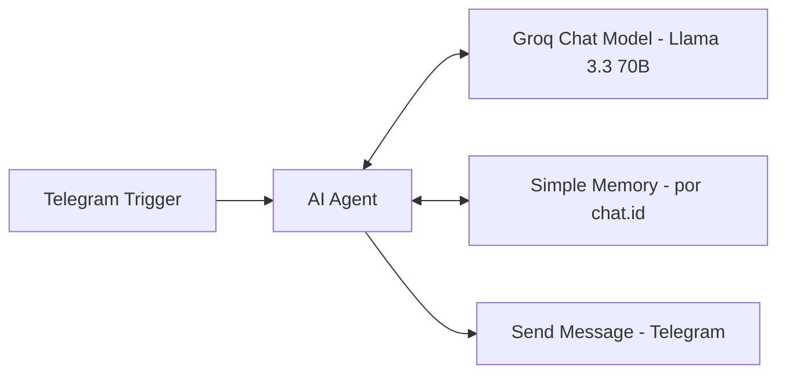

#  SupportGenius — Agente de Atendimento via Telegram com IA

> Agente de IA que responde clientes automaticamente pelo Telegram, usando um FAQ real como base de conhecimento e mantendo memória de conversa — construído com n8n, Groq (LLM gratuito) e Telegram Bot API.

   

---

##  O problema de negócio

Empresas pequenas/médias não têm orçamento pra suporte 24/7, mas clientes esperam resposta imediata sobre dúvidas que já estão documentadas (planos, políticas, horário de atendimento). Esse agente simula o atendimento de primeira linha de uma empresa fictícia de software (TechFácil), respondendo automaticamente com base em uma base de conhecimento real.

##  Arquitetura

##  Como o fluxo funciona

1. **Telegram Trigger** escuta novas mensagens enviadas ao bot.
2. **AI Agent** recebe a mensagem do cliente, orientado por um **System Message** que define seu papel, tom de voz e a base de conhecimento da empresa (planos, suporte, conta/acesso, integrações).
3. O agente usa o **Groq** (modelo `llama-3.3-70b-versatile`, gratuito) como motor de raciocínio e geração de texto.
4. A **Simple Memory** guarda o histórico da conversa, isolado por `chat.id` — cada conversa com um cliente diferente tem seu próprio contexto, sem misturar histórico entre pessoas.
5. A resposta gerada (`$json.output`) é enviada de volta ao mesmo `chat.id` de origem, via nó **Send a text message**.

##  Nós utilizados

| Nó | Função |
|---|---|
| **Telegram Trigger** | Recebe mensagens enviadas ao bot em tempo real |
| **AI Agent** | Orquestra o raciocínio: lê o System Message, consulta o modelo e a memória, gera a resposta |
| **Groq Chat Model** | LLM (Llama 3.3 70B) que gera as respostas em linguagem natural |
| **Simple Memory** | Mantém o histórico da conversa por `chat.id`, sem precisar de banco de dados externo |
| **Send a text message (Telegram)** | Envia a resposta final de volta ao cliente, no mesmo chat |

##  Decisões de arquitetura

- **Base de conhecimento no System Message, não em Vector Store/RAG.** A primeira versão do projeto usava RAG completo (Ollama + embeddings + Simple Vector Store), mas o setup local com ngrok criava instabilidade real de rede entre o n8n e o Ollama. Optei por simplificar: o FAQ inteiro cabe no System Message do agente, sem perda de qualidade de resposta para uma base de conhecimento desse tamanho. Para bases maiores (dezenas de páginas), RAG com Vector Store seria a escolha certa.
- **Memória isolada por `chat.id`**, para simular corretamente um cenário real de atendimento com múltiplos clientes simultâneos, cada um com seu próprio histórico.
- **Groq em vez de OpenAI**, para manter o projeto 100% gratuito de rodar, sem abrir mão de qualidade — o Llama 3.3 70B tem desempenho equivalente ao GPT-4o-mini em tarefas de atendimento.
- **Telegram em vez de WhatsApp** como canal inicial: zero custo, zero burocracia de aprovação, ideal para prototipagem rápida. (Uma versão com WhatsApp via Evolution API está nos próximos projetos do portfólio.)

##  Desafios reais enfrentados (e como resolvi)

| Desafio | Causa | Solução |
|---|---|---|
| Telegram Trigger retornava erro "An HTTPS URL must be provided for webhook" | O n8n local (`localhost:5678`) não é acessível pela internet, e o Telegram exige uma URL pública HTTPS para entregar mensagens | Configurei um túnel com **ngrok** (`ngrok http 5678`) e apontei a variável de ambiente `WEBHOOK_URL` do n8n para a URL pública gerada |
| Erro voltava a aparecer depois de reiniciar o n8n | A URL do ngrok muda a cada nova sessão, e o `WEBHOOK_URL` precisa ser passado toda vez que o processo do n8n é iniciado | Reiniciei o n8n sempre informando a variável de ambiente atualizada com a URL do ngrok mais recente |
| RAG com Ollama gerava erros de conexão intermitentes (`Error fetching options`, timeout) | Setup local com múltiplos serviços (n8n via túnel + Ollama local) criava inconsistência de rede entre os componentes | Simplifiquei a arquitetura: base de conhecimento movida para o System Message do agente, eliminando a dependência de Vector Store/Embeddings para este estágio do projeto |
| Workflow em modo de teste retornava "The connection timed out" | O modo de teste do n8n tem um ciclo de execução mais lento, incompatível com o timeout de resposta do webhook do Telegram | Ativei o workflow em modo de produção (toggle "Active"), que processa as mensagens de forma assíncrona |

##  Hospedagem
Desenvolvido em ambiente local (n8n self-hosted + túnel ngrok). Para produção real, recomenda-se n8n Cloud ou self-host em VPS (Railway/Render) com domínio fixo — eliminando a dependência do ngrok e permitindo funcionamento 24/7 sem depender do computador local estar ligado.

##  Habilidades demonstradas
Arquitetura de AI Agents, integração com LLMs (Groq/Llama), gerenciamento de memória conversacional por sessão, integração com Telegram Bot API, configuração de webhooks e túneis de desenvolvimento (ngrok), engenharia de prompt (System Message) para atendimento ao cliente, simplificação pragmática de arquitetura diante de restrições reais de ambiente.
